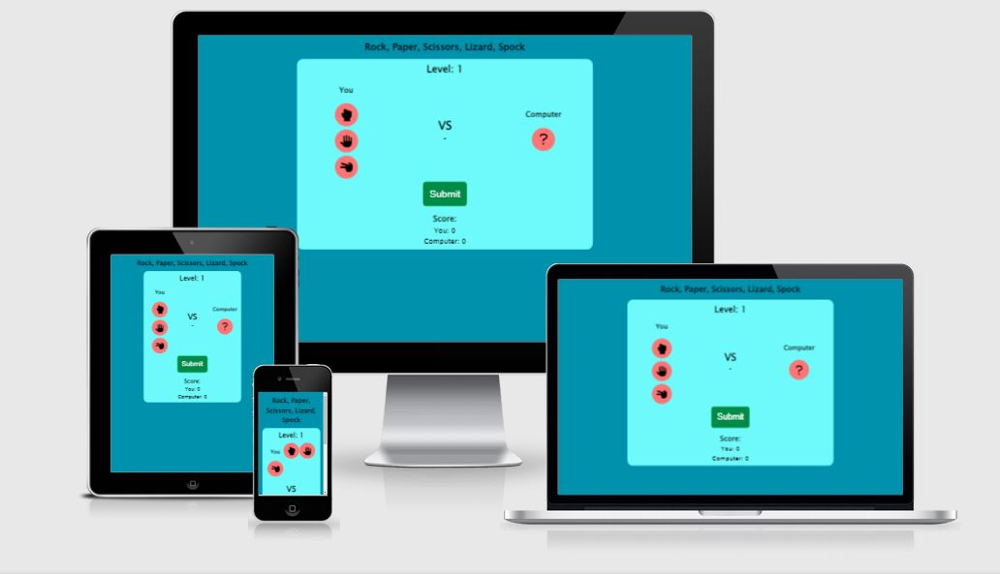
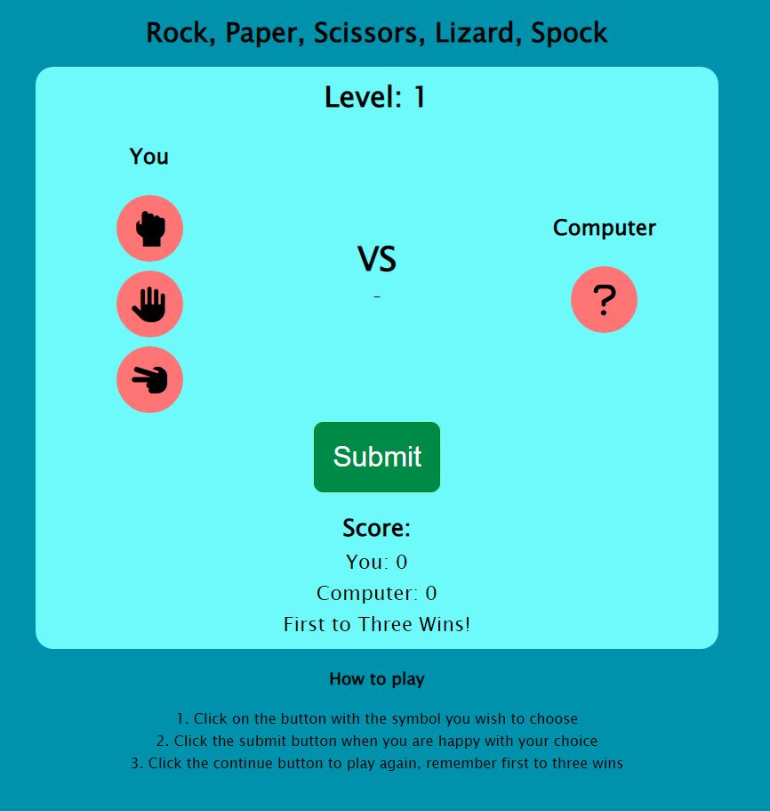
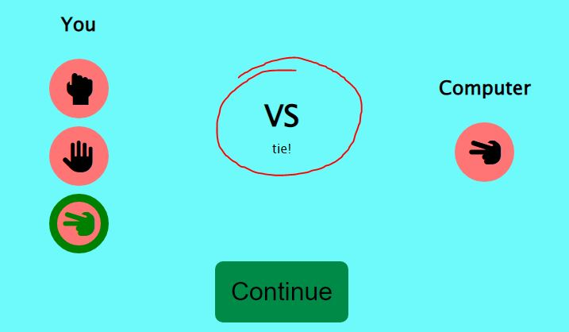
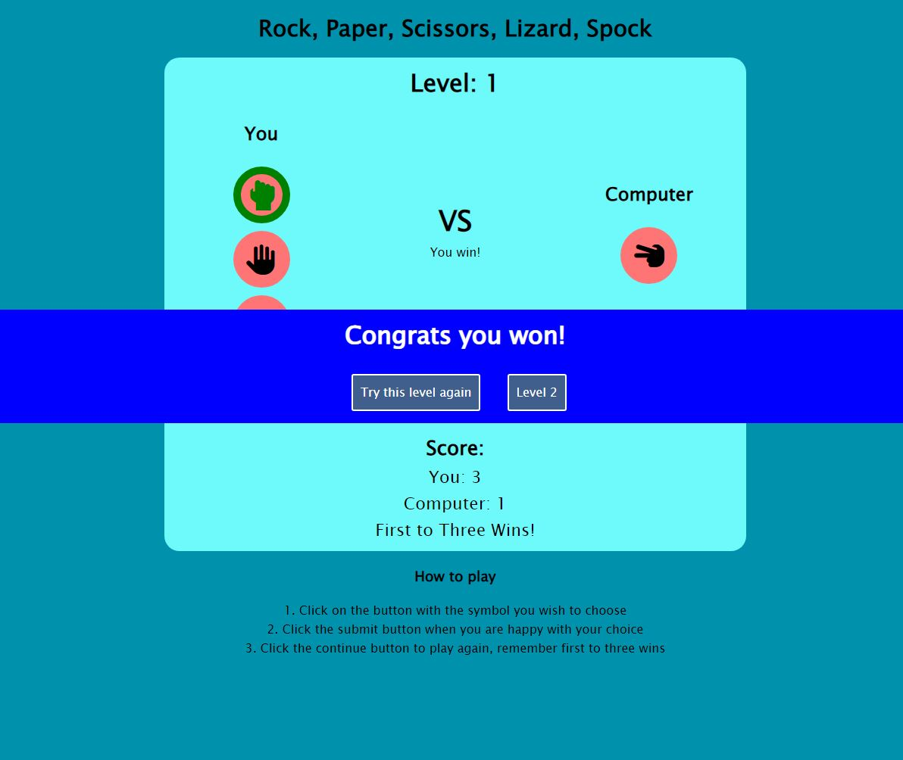

# Wheel of Time Quiz 
Click [here](https://ib-1.github.io/Project-2-Ci/) to view the live web site 

### responsive design 

## UX

## Strategy
 

## Goals
* Create a simple game of rock paper scissors lizard spock
* make the game have increasing levels of difficulty
* To make the game responsive to the users inputs
* Make sure the game functions correctly without bugs

##### To achieve these goals I will need to:
* Use JavaScript to create a fictional game which considers all outcomes
* Use CSS and HTML for the content 
* Use JavaScript to make the game responsive
* Test the game with users

## Functionality
### Load Screen

* On the load screen the user will see the title of the game "Rock, Paper, Scissors, Lizard, Spock" and a light blue section which contains the game, the first level will be level 1 and there will be 3 buttons for them to choose from being rock paper scissors (for the first level), and a big green submit button for them to submit thier choice.

* The user will see the instructions at the bottom of the page so they know how to play the game

 

 

### Active

* There is ineteractive javascript which shows to the user what button is active by giving the button style properties of "border: 20px solid green" and "color: green", also the style will be removed when another button is clicked to show that now that that button is active and ready to be played.

### Result 

* in the center between the User and computer buttons there is text displayed to tell the user who has won the round

 

 

### Winner/Loser Overlay 

* when the user either wins or loses there will be a overlay saying who won and if they won they will be prompted to go to the next level or try the same level again, and if the user has lost they will be prompted to try the level again

 

 