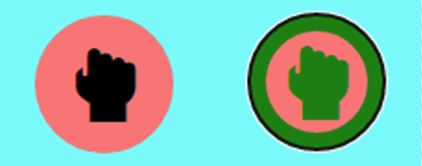

# Wheel of Time Quiz 
Click [here](https://ib-1.github.io/Project-2-Ci/) to view the live web site 

### responsive design 

## UX

## Strategy
 

## Goals
* Create a simple game of rock paper scissors lizard spock
* make the game have increasing levels of difficulty
* To make the game responsive to the users inputs
* Make sure the game functions correctly without bugs

##### To achieve these goals I will need to:
* Use JavaScript to create a fictional game which considers all outcomes
* Use CSS and HTML for the content 
* Use JavaScript to make the game responsive
* Test the game with users

## Functionality
### Load Screen

* On the load screen the user will see the title of the game "Rock, Paper, Scissors, Lizard, Spock" and a light blue section which contains the game, the first level will be level 1 and there will be 3 buttons for them to choose from being rock paper scissors (for the first level), and a big green submit button for them to submit thier choice.

* The user will see the instructions at the bottom of the page so they know how to play the game

 

 

### Active

* There is ineteractive javascript which shows to the user what button is active by giving the button style properties of "border: 20px solid green" and "color: green", also the style will be removed when another button is clicked to show that now that that button is active and ready to be played.

### Result 

* in the center between the User and computer buttons there is text displayed to tell the user who has won the round

 

 

### Winner/Loser Overlay 

* when the user either wins or loses there will be a overlay saying who won and if they won they will be prompted to go to the next level or try the same level again, and if the user has lost they will be prompted to try the level again

 

 

### Levels

 

 

* There are progressing levels with increasing difficulty to entertain online users.

### Score Area

* there is a score area to show the user how many points they have and how many the computer has

 

 

## Testing 

### Validator Testing 

- HTML
    - No errors were returned when passing through the official [W3C validator](https://validator.w3.org/nu/?doc=https%3A%2F%2Fcode-institute-org.github.io%2Flove-maths%2F)
- CSS
    - No errors were found when passing through the official [(Jigsaw) validator](https://jigsaw.w3.org/css-validator/validator?uri=https%3A%2F%2Fvalidator.w3.org%2Fnu%2F%3Fdoc%3Dhttps%253A%252F%252Fcode-institute-org.github.io%252Flove-maths%252F&profile=css3svg&usermedium=all&warning=1&vextwarning=&lang=en)

- JavaScript
    - Metrics
        - There are 10 functions in this file.

        - Function with the largest signature take 1 arguments, while the median is 0.

        - Largest function has 41 statements in it, while the median is 6.

        - The most complex function has a cyclomatic complexity value of 22 while the median is 2.5.

## Deployment 

- The site was deployed to GitHub pages. The steps to deploy are as follows: 
  - In the GitHub repository, navigate to the Settings tab 
  - From the source section drop-down menu, select the Master Branch
  - Once the master branch has been selected, the page will be automatically refreshed with a detailed ribbon display to indicate the successful deployment. 

The live link can be found here - https://ib-1.github.io/Project-2-Ci/

## What i would change
- first I would make my javascript less complicated and with less code as I know it would require far less for a simple game
- i would make all the levels into one page, instead of making the levels into different pages i would give a variable the html of the level and attach it to the game container when the level is called.
- improve media quiries for phone layout
- add more design to the page and sound effects eg a cheer sound effect when the user wins and a sad trumbone when the user loses

## Problems i encountered
- one problem I encountered was the continue button. I originally created it as a new element within the javascript but then that would mean the loop when the page loads will not add a event listener, to fix this i added the continue button within the html and gave it a "visibilty: none" so it would have a event listener of click
- another problem i encountered was the computers guess. I originally created the computers guess with a value beteeen 1-5 and that number will be assign to Rock, Paper, Scissors, Lizard, Spock respectively. but this wouldnt work in level one as there shouldnt be lizard or spock in level 1 and would be a unfair advantage in the computers favor so for each page i made sure that it guessed a fair answer.

## Credits
- Used code support website such as Stack overflow and W3school to help code my project
- Support from people in the Slack CI Community